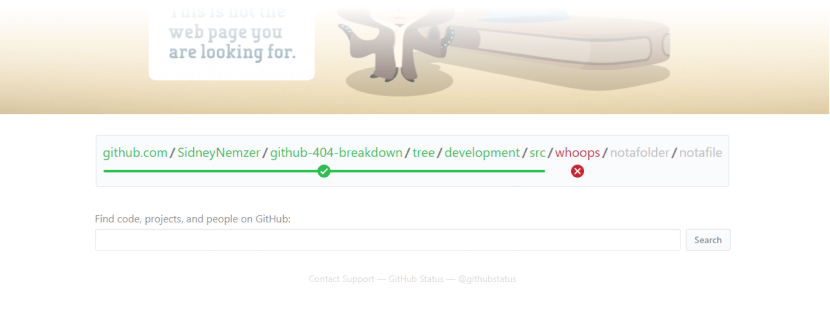

# GitHub 404 Breakdown

[][chrome-web-store]

<picture>
  <source media="(prefers-color-scheme: dark)" srcset="./images/screenshot-dark.png">
  
</picture>

A Chrome extension that explains why GitHub returned a 404

- [**INSTALL**][chrome-web-store] - On the Chrome Web Store
- [**FEEDBACK / BUG REPORT**][issues] - Submit a question, idea, or bug report
- [**CONTRIBUTING**][contributing] - See this doc if you're interested in contributing code

_Note: This extension was not created by GitHub_

[chrome-web-store]: https://chrome.google.com/webstore/detail/github-404-breakdown/pnhdlhabpckpibnkkddmgcimdejbljge
[issues]: https://github.com/SidneyNemzer/github-404-breakdown/issues/new
[contributing]: CONTRIBUTING.md
